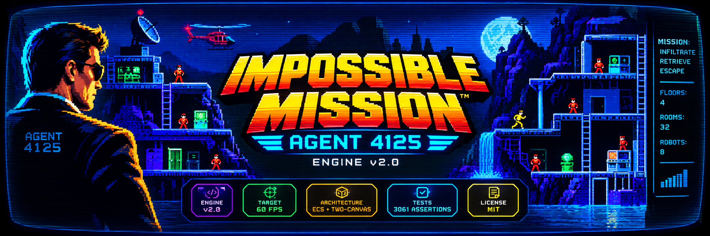

<div align="center">



<br/>
<br/>

# Impossible Mission: Agent 4125

### Engine v2.0

**A high-performance, modular ES6 browser-game remake of the Commodore 64 classic _Impossible Mission_.**

<p>
  
  
  
  
  
</p>

</div>

---

## 🎮 Overview

**Impossible Mission: Agent 4125 — Engine v2.0** is an enterprise-grade browser game engine designed around retro-game precision and modern web-performance architecture.

The project recreates the atmosphere of espionage, platforming, robots, terminals, exploration, and puzzle assembly while modernizing the underlying engine with deterministic simulation, modular systems, asynchronous-ready networking, WebGL CRT post-processing, and high-performance physics and AI.

### Core Goals

- 🎯 Locked **60 FPS** gameplay target
- 🖥️ Authentic **CRT visual pipeline** with WebGL2 post-processing
- 🤖 FSM-driven robot AI with **line-of-sight detection** and **A\* pathfinding**
- ⚡ Zero-allocation hot-path physics and ECS data structures
- 🧩 Deterministic procedural level generation
- 🔊 Layered Web Audio API middleware with spatial audio and reverb
- 🧪 Comprehensive automated testing with **3,061 assertions**
- 🌐 REST, cloud-save, leaderboard, telemetry, and WebSocket integration stubs

---

## ✨ Technical Highlights

| System | Implementation |
| --- | --- |
| Rendering | Canvas2D offscreen world buffer + WebGL2 CRT post-processing |
| Logical Resolution | `640 × 400` |
| Frame Target | `60 FPS` |
| Game Architecture | ECS + modular systems |
| Physics | Swept AABB collision detection + zero-allocation quadtree |
| Robot AI | FSM + LOS raycasting + 1D A\* |
| Randomness | Seeded XOR-shift RNG |
| Levels | 32 rooms across 4 floors |
| Audio | Web Audio API + spatial panning + procedural reverb |
| UI | DOM HUD + minimap + puzzle interfaces |
| Networking | REST API client + WebSocket co-op stub |
| Build Tooling | Vite |
| Runtime | Modern ES6+ browser |
| Tests | 3,061 assertions |
| License | MIT |

---

## 🖥️ Rendering Pipeline

The rendering architecture deliberately separates **game simulation**, **world rendering**, and **visual presentation**.

```text
┌─────────────────────────────────────────────────────────────────┐
│                        GAME SIMULATION                           │
│          ECS • Physics • AI • Systems • State • RNG             │
└───────────────────────────────┬─────────────────────────────────┘
                                │
                                ▼
┌─────────────────────────────────────────────────────────────────┐
│                    CANVAS2D WORLD RENDERER                      │
│                         640 × 400                                │
│                                                                 │
│  Backgrounds • Shafts • Platforms • Hazards • Furniture         │
│  Terminals • Robots • Particles • Agent                         │
└───────────────────────────────┬─────────────────────────────────┘
                                │
                                ▼
┌─────────────────────────────────────────────────────────────────┐
│                     WEBGL2 CRT POST-PROCESSOR                   │
│                                                                 │
│  Barrel Distortion • Chromatic Aberration • Bloom               │
│  Scanlines • Phosphor Flicker • Vignette                        │
└───────────────────────────────┬─────────────────────────────────┘
                                │
                                ▼
┌─────────────────────────────────────────────────────────────────┐
│                         DOM UI LAYER                             │
│                                                                 │
│  HUD • Minimap • Notifications • Puzzle / Simon Interface       │
│  CRT Bezel / Presentation Wrapper                               │
└─────────────────────────────────────────────────────────────────┘
```

### CRT Effects

The WebGL2 post-processing stage applies:

- **Barrel distortion:** `strength = 0.12`
- **Chromatic aberration:** `offset = 0.006`
- **Bright-pixel bloom:** `5 × 5` box blur with threshold `0.55`
- **Scanlines**
- **Phosphor flicker:** approximately `4%` noise
- **Vignette shading**

---

## 🏗️ Architecture

The engine is organized around a modular ECS-oriented design. Runtime systems operate on lightweight data structures and avoid unnecessary allocations inside performance-critical loops.

### Entity-Component-System

The ECS layer provides:

- Plain-old-data component storage
- Entity lifecycle management
- Custom object pools
- Reusable vectors, rectangles, and particles
- Reduced garbage-collection pressure
- Clear separation between state and system behavior

### Deterministic Simulation

A seeded XOR-shift random-number generator provides deterministic world reconstruction.

This enables:

- Reproducible procedural levels
- Daily seeded challenges
- Deterministic test scenarios
- Snapshot creation and restoration
- Repeatable debugging sessions

---

## ⚙️ Physics & Performance

The physics subsystem is designed specifically for predictable behavior under a fixed-frame gameplay model.

### Collision Detection

The engine includes:

- AABB collision tests
- Swept AABB collision detection
- Platform and hazard queries
- Spatial partitioning through a custom quadtree
- Reusable vector and rectangle objects

Swept AABB prevents high-speed entities from tunneling through thin collision surfaces.

The quadtree provides efficient spatial queries for:

- Robot proximity detection
- Hazard queries
- Collision candidate filtering
- Local entity searches

---

## 🤖 Robot AI

Robot behavior is implemented as a finite-state machine with deterministic transitions.

```text
                    ┌─────────────┐
                    │    IDLE     │
                    │  PATROLLING │
                    └──────┬──────┘
                           │
                    LOS / ACOUSTIC
                           │
                           ▼
                    ┌─────────────┐
                    │    ALERT    │
                    │  A* PURSUIT │
                    └──────┬──────┘
                           │
                     EMP / SNOOZE
                           │
                           ▼
                    ┌─────────────┐
                    │  STUNNED    │
                    │   FROZEN    │
                    └─────────────┘
```

### States

| State | Behavior |
| --- | --- |
| `IDLE` | Patrol and monitor the environment |
| `ALERT` | Pursue the agent using A\* pathfinding |
| `STUNNED` | Temporarily immobilized by EMP / snooze mechanics |

### Detection

Robots can react to:

- Line-of-sight events
- Acoustic radius events
- Environmental state
- Player position

The implementation includes a **1D A\*** pathfinding routine optimized for the game's constrained platforming environment.

The benchmark target includes **8 concurrent hunter robots** completing pathfinding routines with a reported mean execution time of approximately **0.026 ms per frame**.

---

## 🔊 Audio Middleware

Audio is implemented directly on the Web Audio API and organized into dedicated buses.

```text
                         AUDIO ENGINE
                              │
              ┌───────────────┼───────────────┐
              │               │               │
              ▼               ▼               ▼
           MUSIC             SFX            VOICE
              │               │               │
              │               ├─ Spatial Pan │
              │               ├─ Reverb      ├─ Speech
              │               └─ Room IR     │  Synthesis
              │
              └─ 55 Hz + 58.5 Hz beating drone
```

### Audio Features

- Dedicated Music, SFX, and Voice buses
- Stereo spatial panning via `StereoPannerNode`
- Procedural room impulse response
- Approximately `120 ms` room impulse response target
- Procedural ambient drone
- Speech synthesis for antagonist / system barks

---

## 📂 Project Structure

> The directory tree is kept inside a fenced code block so GitHub renders the hierarchy with fixed-width alignment.

```text
im-engine/
├── index.html
├── vite.config.js
├── package.json
├── src/
│   ├── main.js
│   ├── Game.js
│   ├── engine/
│   │   ├── ECS.js
│   │   ├── State.js
│   │   ├── RNG.js
│   │   └── Pool.js
│   ├── entities/
│   │   ├── LevelGen.js
│   │   └── PasswordSystem.js
│   ├── physics/
│   │   └── Physics.js
│   ├── ai/
│   │   └── RobotAI.js
│   ├── audio/
│   │   └── AudioMiddleware.js
│   ├── renderer/
│   │   ├── CRTRenderer.js
│   │   └── WorldRenderer.js
│   ├── systems/
│   │   ├── PlatformSystem.js
│   │   └── PlayerSystem.js
│   ├── ui/
│   │   └── UISystem.js
│   └── network/
│       └── Network.js
├── tests/
│   ├── run.js
│   └── bench.js
└── docs/
    └── TDD.md
```

### Directory Reference

| Path | Responsibility |
| --- | --- |
| `index.html` | Application shell and canvas/UI containers |
| `vite.config.js` | Vite build configuration |
| `package.json` | Dependencies and npm scripts |
| `src/main.js` | Application entry point and DOM wiring |
| `src/Game.js` | Central game orchestrator |
| `src/engine/` | ECS, state, RNG, and object-pool infrastructure |
| `src/entities/` | Procedural level and password systems |
| `src/physics/` | Collision, quadtree, and spatial queries |
| `src/ai/` | Robot state machine, LOS, and pathfinding |
| `src/audio/` | Web Audio middleware |
| `src/renderer/` | Canvas2D world renderer and WebGL2 CRT renderer |
| `src/systems/` | Player and platform simulation systems |
| `src/ui/` | HUD, minimap, overlays, and puzzle interfaces |
| `src/network/` | REST and WebSocket integration stubs |
| `tests/` | Automated tests and performance benchmarks |
| `docs/` | Technical design documentation |

---

## 🚀 Getting Started

### Prerequisites

- **Node.js 18+** recommended
- npm or Yarn
- A modern browser with WebGL2 and Web Audio API support

### Installation

Clone the repository and install dependencies:

```bash
git clone https://github.com/david-spies/im-engine.git
cd im-engine
npm install
```

### Development Server

Start the Vite development server with Hot Module Replacement:

```bash
npm run dev
```

Then open the local development URL reported by Vite, typically:

```text
http://localhost:3000
```

> If your local Vite configuration selects a different port, use the URL printed in the terminal.

---

## 📦 Production Build

Create the optimized production bundle:

```bash
npm run build
```

The production assets are generated in:

```text
dist/
```

The current optimized build target is approximately:

```text
JavaScript: ~55.5 KB minified
JavaScript: ~19.8 KB gzipped
```

Serve the production build locally with:

```bash
npx serve dist
```

---

## 🧪 Testing

Run the complete Node.js test suite:

```bash
npm test
```

The test suite currently contains:

```text
3,061 assertions
```

Run the performance benchmarks with:

```bash
npm run bench
```

### Benchmark Coverage

The benchmark suite evaluates representative engine workloads, including:

- Physics operations
- Spatial queries
- AI/pathfinding workloads
- ECS operations
- Runtime hot-path behavior

---

## 🌐 Networking & Cloud Integration

`src/network/Network.js` contains API client infrastructure designed to connect the game engine to an external backend.

### REST Endpoints

The current client stubs support:

```text
GET  /leaderboard
POST /leaderboard

GET  /save
POST /save

GET  /daily-seed

POST /telemetry
```

### Cooperative Multiplayer

The networking layer also includes WebSocket client stubs for future cooperative features, including:

- Lockstep synchronization
- Ghost-sprite interpolation
- Shared state synchronization
- Multiplayer session infrastructure

These interfaces are intentionally decoupled from the core simulation so network functionality can evolve without coupling the renderer or gameplay systems to a specific backend.

---

## 🧩 Gameplay Systems

The engine is designed around the classic **Impossible Mission** gameplay loop:

```text
             ┌───────────────┐
             │    EXPLORE    │
             └───────┬───────┘
                     │
                     ▼
             ┌───────────────┐
             │    EVADE      │
             │    ROBOTS     │
             └───────┬───────┘
                     │
                     ▼
             ┌───────────────┐
             │ SEARCH ROOMS  │
             │ & TERMINALS   │
             └───────┬───────┘
                     │
                     ▼
             ┌───────────────┐
             │ COLLECT CODE  │
             │   FRAGMENTS   │
             └───────┬───────┘
                     │
                     ▼
             ┌───────────────┐
             │ SOLVE PUZZLES │
             └───────┬───────┘
                     │
                     ▼
             ┌───────────────┐
             │ ASSEMBLE THE  │
             │    PASSWORD   │
             └───────┬───────┘
                     │
                     ▼
             ┌───────────────┐
             │    ESCAPE     │
             └───────────────┘
```

---

## 📊 Engine Snapshot

```text
ENGINE                  v2.0
LOGICAL VIEWPORT        640 × 400
FRAME TARGET            60 FPS
FLOORS                  4
ROOMS                   32
CONCURRENT ROBOTS       8
TEST ASSERTIONS         3,061
RENDERING               Canvas2D + WebGL2
AI                      FSM + A*
RANDOMNESS              Seeded XOR-shift
PHYSICS                 Swept AABB + Quadtree
AUDIO                   Web Audio API
BUILD                   Vite
LICENSE                 MIT
```

---

## 🧭 Design Principles

The engine follows several core principles:

### Determinism First

Gameplay state should be reproducible whenever possible. Seeded randomness and snapshot support make debugging and regression testing significantly easier.

### Separate Simulation From Presentation

Game state and simulation systems do not depend on the CRT renderer. The same world state can therefore be presented through different rendering pipelines.

### Avoid Hot-Path Allocation

Performance-sensitive loops use reusable objects, pools, and plain data structures to minimize garbage-collection interruptions.

### Modular Systems

Gameplay functionality is divided into focused systems rather than concentrated in a monolithic game loop.

### Test the Engine, Not Just the Interface

The automated suite focuses heavily on deterministic logic, physics, AI, state transitions, and engine infrastructure rather than relying exclusively on browser-level tests.

---

## 📚 Documentation

The detailed technical design is maintained in:

```text
docs/TDD.md
```

The TDD documents the engine architecture, implementation decisions, subsystem contracts, performance goals, and testing strategy.

---

## ⚠️ Project Status

**Engine v2.0**

The project is structured as a modular, performance-oriented browser implementation with the major engine subsystems represented in the repository architecture.

Networking and cooperative multiplayer components currently provide integration stubs intended for future backend implementation.

---

## 📜 License

Impossible Mission: Agent 4125 is open-source software licensed under the **MIT License**.

See the repository license file for the complete license text.

---

<div align="center">

### IMPOSSIBLE MISSION: AGENT 4125

**Explore. Evade. Assemble. Escape.**

_Engineered for retro precision at 60 FPS._

</div>
